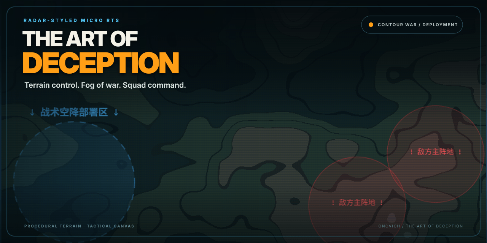

# TheArtOfDeception

[简体中文](README.zh-CN.md)

[Play online](https://game.onovich.com/TheArtOfDeception/)

TheArtOfDeception is a radar-styled micro RTS about deploying squads, reading contour terrain, and using fog, elevation, and formation control to defeat a larger force.



## How to play

- Deploy the army inside the marked starting zone.
- Select the whole army or one of the numbered squads from the command panel.
- Click the battlefield to issue a movement order.
- Put archers on high ground and use infantry to hold or draw enemies into weaker terrain.
- Protect the general and eliminate every enemy squad.

## Features

- Procedural contour terrain with movement and damage advantages tied to elevation.
- Fog of war and weather-modified vision.
- Infantry, archers, scouts, a general, and squad formation targets.
- Ranged volleys, melee impacts, battlefield remains, and a tactical event log.
- Layered Canvas rendering inside a Vite and React application.

## Development

Install dependencies and start the local app:

```bash
npm install
npm run dev
```

Build and preview the production bundle:

```bash
npm run build
npm run preview
```

## Project structure

- `src/data/gameConfig.js` contains shared terrain, squad, deployment, and interface data.
- `src/logic/engine/` contains terrain generation, entities, formations, and spawn rules.
- `src/logic/hooks/useContourWarGame.js` coordinates the battle loop and Canvas bridge.
- `src/view/` contains the battlefield, command panel, status, briefing, and battle log.
- `origin/` preserves the original single-file prototype and design notes.

## Status

The current browser build is a playable tactics prototype with deployment, squad commands, terrain effects, fog of war, victory, and defeat conditions. Some battle-loop and Canvas coordination still lives in the main gameplay hook, and the repository has no automated test suite. Treat it as a focused prototype rather than a finished RTS.

## License

No open-source license is currently included in this repository.
